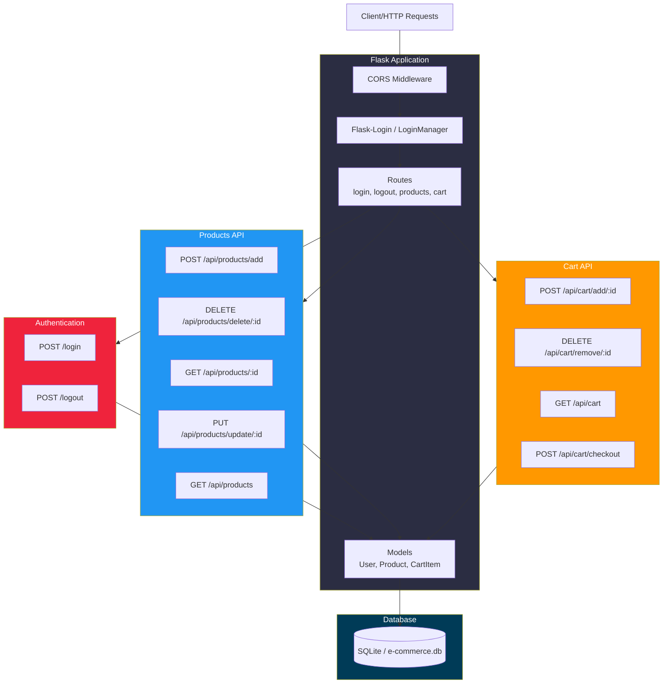

<h1 align="center">E-COMMERCE</h1>

<p align="center">
  RESTful API for an e-commerce system
</p>

<p align="center">
  <a href="#architecture">ARCHITECTURE</a> &nbsp;&nbsp;&nbsp;|&nbsp;&nbsp;&nbsp;
  <a href="#project">PROJECT</a> &nbsp;&nbsp;&nbsp;|&nbsp;&nbsp;&nbsp;
  <a href="#technologies">TECHNOLOGIES</a> &nbsp;&nbsp;&nbsp;|&nbsp;&nbsp;&nbsp;
  <a href="#run">RUN</a> &nbsp;&nbsp;&nbsp;|&nbsp;&nbsp;&nbsp;
  <a href="#license">LICENSE</a>
</p>

<p align="center">
  
</p>

## 🏗️ <a id="architecture"></a> ARCHITECTURE



## 💻 <a id="project"></a> PROJECT

"E-COMMERCE" is a RESTful API for managing products, shopping cart, and user authentication in an e-commerce platform.

## 🌐 <a id="technologies"></a> TECHNOLOGIES

This project was developed using the following technologies:

- Flask
- Python
- SQLite
- Git and Github

## ⚙️ <a id="run"></a> RUN

To install the required dependencies, run the following command:

```sh
pip3 install -r requirements.txt
```

## ⚖️ <a id="license"></a> LICENSE

This project is licensed under the MIT License.

---

Made with ♥ by Miguel
